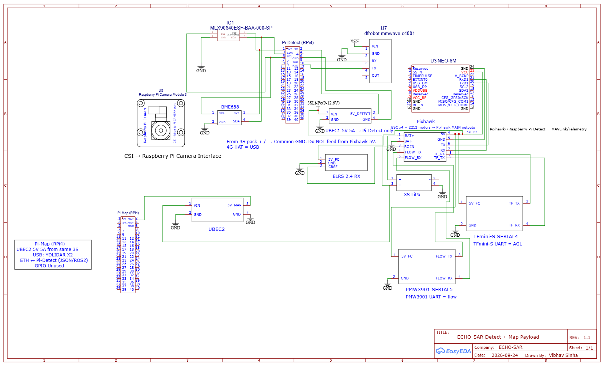
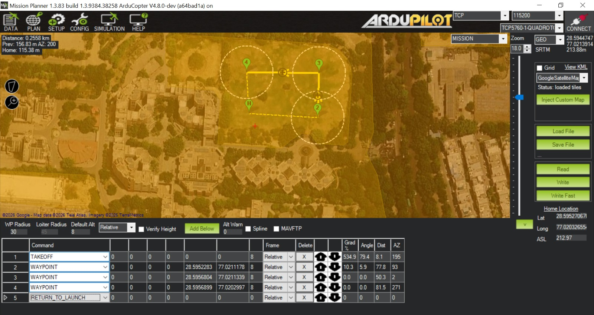

# ECHO-SAR
**SIH 2026 · PS SIH26177 · Qualcomm (hardware / Robotics and Drones)**

Life-detection payload on a GPS-Auto quadrotor.  
Pixhawk flies. Two Raspberry Pi 4s split payload compute.  
Sponsor silicon is not on the airframe.

## Flight vs payload
| Unit | Role |
|---|---|
| **Pixhawk + ArduCopter** | GPS Auto, RTL, TFmini-S AGL, PMW3901 short hold, ELRS, motors |
| **Pi-Detect** | Cam3 Wide (CSI), MLX90640 (I2C 3.3 V), C4001 (UART 3.3 V), BME688 (I2C, VOC proxy not CO₂), 4G HAT (USB), TFLite + fusion, MAVLink UART to Pixhawk, Wi-Fi/4G dashboard |
| **Pi-Map** | YDLIDAR X2 or RPLIDAR A1 (USB), 2D occupancy / obstacles, Ethernet to Detect (JSON or ROS 2) |

Detection still runs if 4G is down. Pilot always has ELRS.

## Power
- One 3S pack  
- UBEC1 5 V 5 A → Pi-Detect (`5V_DETECT`)  
- UBEC2 5 V 5 A → Pi-Map (`5V_MAP`)  
- Common ground  
- Do not power either Pi from Pixhawk 5 V  

## How the two Pis talk
Ethernet only. Map publishes a small obstacle list. Detect fuses camera / thermal / radar / VOC with that list and may request Loiter on Pixhawk. GPIO on Map is unused. Lidar is not wired to Detect.

## Repo
- `hardware/` EasyEDA block schematic **Rev 1.1**
- `sitl/` Mission Planner ArduCopter SITL: campus-pinned TAKEOFF → 8 m box → RTL  

SITL is a PC simulation of the flight plan. It is not a logged flight. “RTK” in the sim HUD is not the real NEO-M8N GPS.

## v1 scope
GPS Auto is real. GPS-denied is a short optical-flow hold.  
Building on a waypoint: Loiter + pilot goes around.  
BME688 is not a CO₂ sensor.

## Webots simulation (reference only)
`sim/webots-ref` is the [misaka10111/Disaster-Response-Drone](https://github.com/misaka10111/Disaster-Response-Drone) project (MIT).

What that sim is: Webots + Crazyflie, lawnmower search, YOLOv8 on a downward camera, GPS goto. Their SLAM file is visualization only.

What it is not: our Pixhawk, S500, dual Pi 4, ELRS, or Rev 1.1 schematic.

Our own flight-plan sim is Mission Planner ArduCopter SITL in `sitl/` (TAKEOFF → 8 m box → RTL).

## Status
Schematic frozen Rev 1.1. SITL mission screenshot added. Bench wiring and airframe next.

